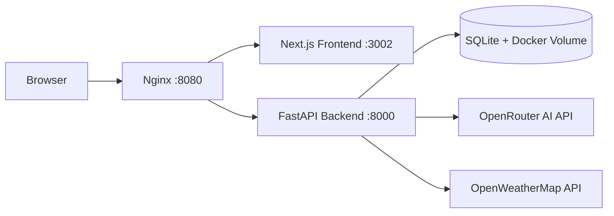
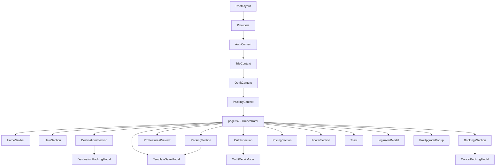
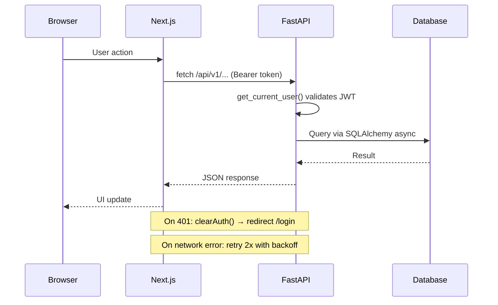
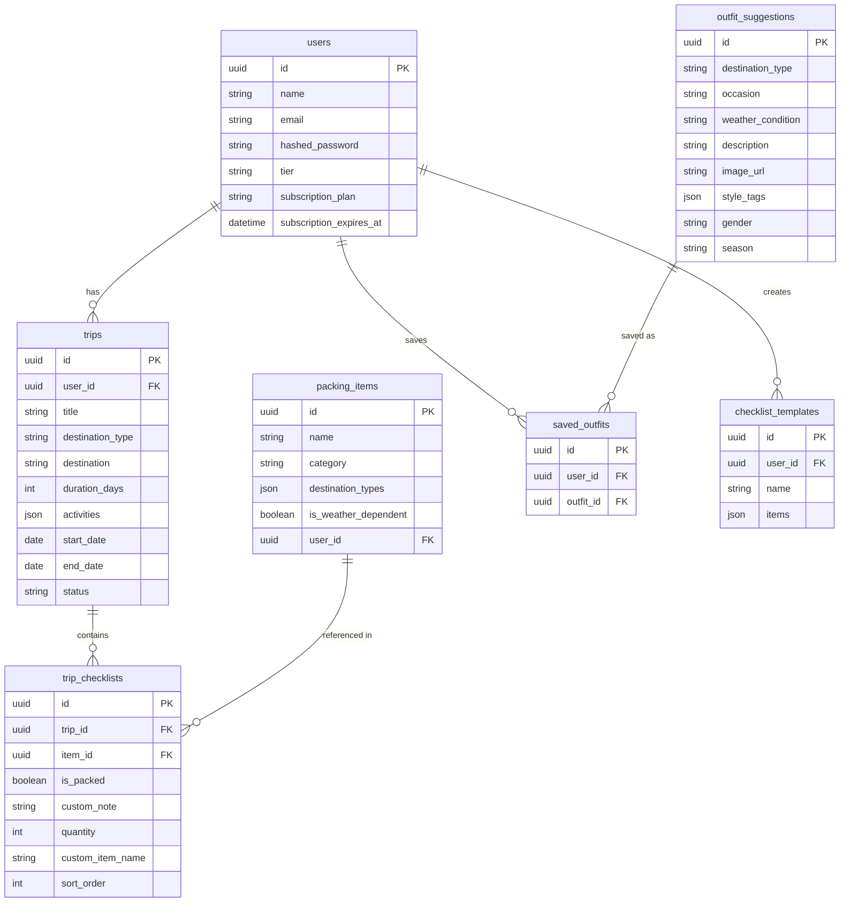
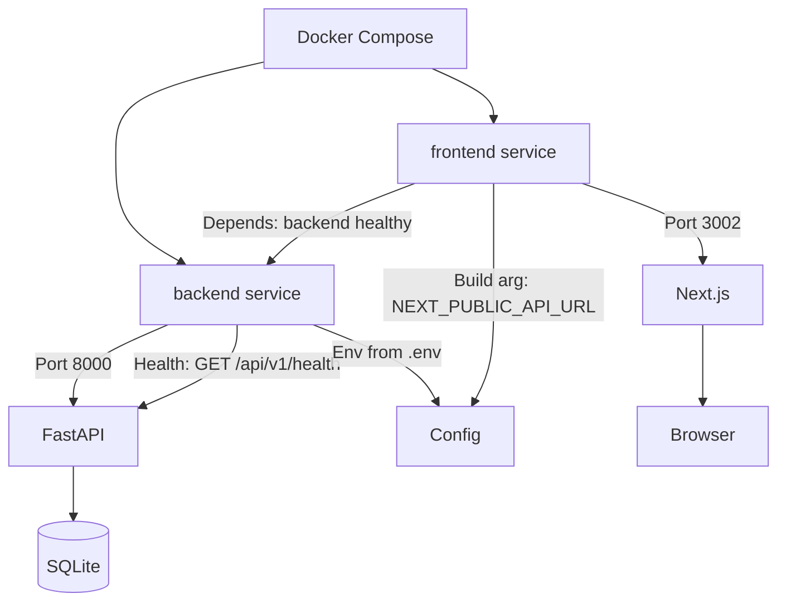

# Pack&Glow Architecture

## System Overview



## Frontend Architecture



### Data Flow

- **AuthContext** — localStorage-backed user state (JWT token, user info, tier)
- **TripContext** — fetches trips from API, persists currentTrip to localStorage
- **OutfitContext** — fetches outfits + saved outfits from API
- **PackingContext** — manages packing items, checklists, templates, AI generation
- **usePageState** — shared page state (isPro, toast, template handlers, scrollTo)
- **lib/data/** — static configuration (destinations, categories, pricing, booking helpers)

## Backend Architecture

```mermaid
graph TD
    App[FastAPI App] --> CORS[CORS Middleware]
    App --> RateLimit[SlowAPI Rate Limiting]
    App --> ReqLog[Request Logging]

    App --> Routers
    Routers --> Health[/api/v1/health]
    Routers --> Users[/api/v1/users]
    Routers --> Trips[/api/v1/trips]
    Routers --> PackingItems[/api/v1/packing-items]
    Routers --> Checklists[/api/v1/checklists]
    Routers --> Outfits[/api/v1/outfit-suggestions]
    Routers --> SavedOutfits[/api/v1/saved-outfits]
    Routers --> Templates[/api/v1/templates]
    Routers --> PackingAssistant[/api/v1/packing-assistant]
    Routers --> Weather[/api/v1/weather]
    Routers --> Chat[/api/v1/chat]

    PackingAssistant --> AIPacking[ai_packing.py]
    Chat --> AIChat[ai_chat.py]
    AIPacking --> PackingRules[packing_rules.py]
    Weather --> OWM[OpenWeatherMap]
```

### Layer Structure

```
backend/app/
  main.py          — FastAPI app, CORS, rate limiting, middleware
  config.py        — Pydantic settings from env vars
  database.py      — SQLAlchemy async setup
  auth.py          — JWT token creation/validation
  rate_limit.py    — SlowAPI configuration
  models/          — SQLAlchemy ORM models
  routers/         — API endpoint handlers
  services/        — Business logic (AI, packing rules)
  schemas/         — Pydantic request/response models
```

## API Request Flow



## Database Schema



## Deployment


